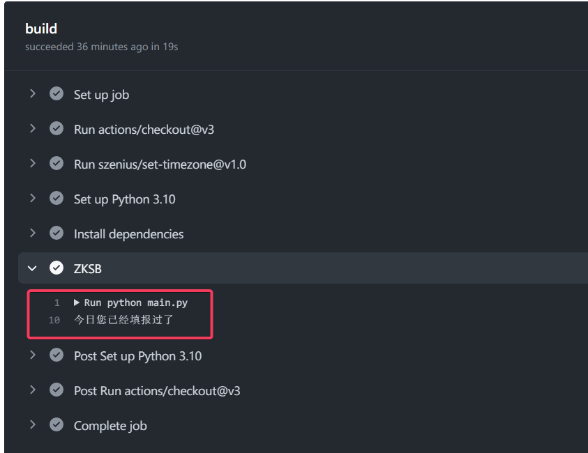
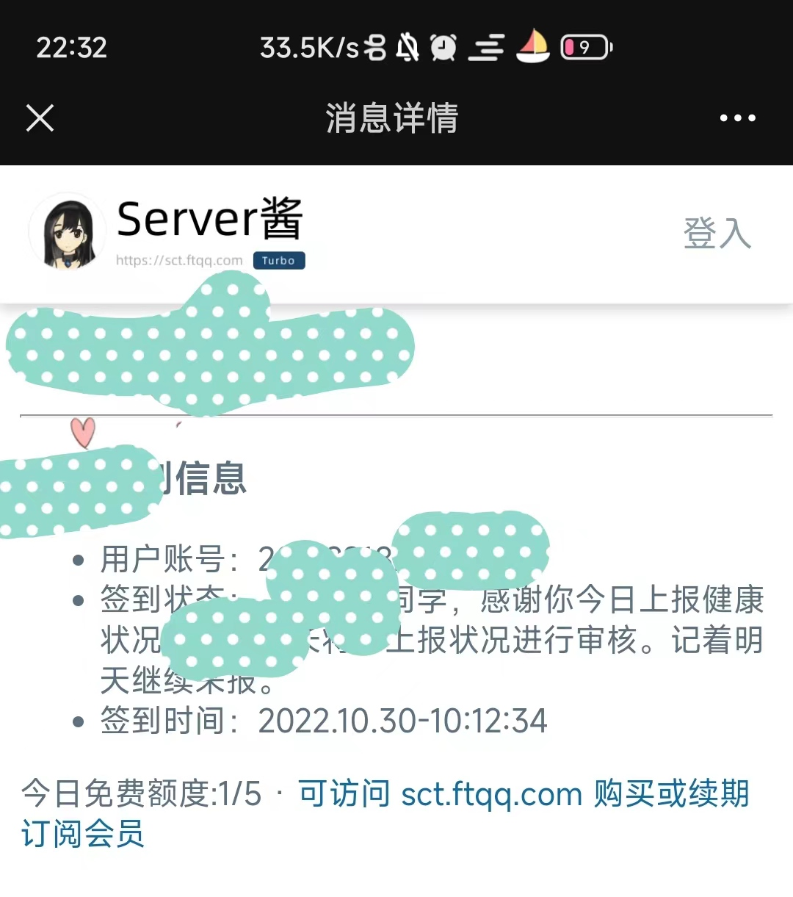

# ZZU健康上报


> 声明：本项目为Python学习交流的开源非营利项目，仅作为程序员之间相互学习交流之用。严禁用于商业用途，禁止使用本项目进行任何盈利活动。使用者请遵从相关政策。对一切非法使用所产生的后果，我们概不负责。本项目对您如有困扰请联系我们删除。


## 参数说明

`user.json`参数说明 

```json
[
    {
        "uid":"20*****",
        "upw":"*****",
        "sckey":"SCT5***************"
    }
]
```

`uid`: 用户学号；`upw`: 用户密码； `sckey`: [Server酱](https://sct.ftqq.com/)密钥

> 注：使用本地部署或者服务器部署才会用到此文件

`submit_data.json`参数说明

| 序号 | 参数名称     | 可选值            | 说明                                                 |
| ---- | ------------ | ----------------- | ---------------------------------------------------- |
| 1    | myvs_1       | 是；否            | 您今天是否有发热症状                                 |
| 2    | myvs_2       | 是；否            | 您今天是否有咳嗽症状                                 |
| 3    | myvs_3       | 是；否            | 您今天是否有乏力或轻微乏力症状                       |
| 4    | myvs_4       | 是；否            | 您今天是否有鼻塞、流涕、咽痛或腹泻等症状             |
| 5    | myvs_5       | 是；否            | 您今天是否被所在地医疗机构确定为确诊病例             |
| 6    | myvs_7       | 是；否            | 您是否被所在地政府确定为密切接触者                   |
| 7    | myvs_8       | 是；否            | 您是否被所在地政府确定为次密切                       |
| 8    | myvs_11      | 是；否            | 您今天是否被所在地医疗机构进行院内隔离观察治疗       |
| 9    | myvs_12      | 是；否            | 您今天是否被要求在政府集中隔离点进行隔离观察         |
| 10   | myvs_13      | 是；否            | 您今日是否被所在地政府有关部门或医院要求居家隔离观察 |
| 11   | myvs_15      | 是；否            | 共同居住人是否有确诊病例                             |
| 12   | **myvs_13a** | 默认41            | 当前实际所在地（若出差填写出差地）省份(自治区)       |
| 13   | **myvs_13b** | 默认4101          | 地市                                                 |
| 14   | **myvs_13c** | 默认科学大道100号 | 填写详细位置                                         |
| 15   | myvs_24      | 是；否            | 您是否为当日返郑人员                                 |
| 16   | memo22       | 待定              | 位置获取情况                                         |

主要修改加黑的三个参数`myvs_13a`、`myvs_13b`和`myvs_13c`，其他参数请根据实际情况修改。

<details>
<summary>myvs_13a参数可选值</summary>
11:北京市
12:天津市
13:河北省
14:山西省
15:内蒙古自治区
21:辽宁省
22:吉林省
23:黑龙江省
31:上海市
32:江苏省
33:浙江省
34:安徽省
35:福建省
36:江西省
37:山东省
41:河南省
42:湖北省
43:湖南省
44:广东省
45:广西壮族自治区
46:海南省
50:重庆市
51:四川省
52:贵州省
53:云南省
54:西藏自治区
61:陕西省
62:甘肃省
63:青海省
64:宁夏回族自治区
65:新疆维吾尔自治区
66:新疆生产建设兵团
71:台湾省
81:香港特别行政区
82:澳门特别行政区
99:国外
</details>

<details>
<summary>myvs_13b参数可选值</summary>
4100：河南省
4101：郑州市
4102：开封市
4103：洛阳市
4104：平顶山市
4105：安阳市
4106：鹤壁市
4107：新乡市
4108：焦作市
4109：濮阳市
4110：许昌市
4111：漯河市
4112：三门峡市
4113：南阳市
4114：商丘市
4115：信阳市
4116：周口市
4117：驻马店市
4118：济源市
4127：河南省周口市川汇区
4151：郑州大学主校区
4152：郑州大学南校区
4153：郑州大学北校区
4154：郑州大学东校区
4155：郑州大学洛阳校区
4156：郑州大学护理校区
4157：郑州大学农学院校区
4190：河南省省直辖县级行政区划

</details>

## 部署

## 本地部署

#### 步骤

1、克隆仓库

```shell
$git clone https://github.com/yunke120/zzu-jksb.git
```

2、安装依赖

```shell
$pip install -r requirements.txt
```

3、修改`user.json`（将`user_sample.json`拷贝并重命名）

| 属性    | 值                                    |
| ------- | ------------------------------------- |
| `uid`   | 用户学号                              |
| `upw`   | 用户密码                              |
| `sckey` | [Server酱](https://sct.ftqq.com/)密钥 |

支持多用户，示例

```json
[
    {
        "username":"2021****",
        "password":"12345678",
        "sckey":"SCT*****"
    },
    {
        "username":"2020****",
        "password":"1234567890",
        "sckey":"SCT*****"
    }
]
```

4、运行

```shell
$python main.py
```


### 服务器部署

​		步骤基本与本地部署一样(前3步)，不同的是，使用linux系统中的定时脚本来完成，如下：

3. 打开文件`crontab`

```shell
$vi /etc/crontab
```

4. 添加以下代码，需确认有`python3`环境，`main.py`改为绝对路径

```python
0 0 3 * * *  python3 main.py
```

也可以通过宝塔面板安装Python项目管理器进行部署。

### Github Actions（推荐）

1. fork项目到自己的账户中

2. 在`Setting->Secrets->Actions->New respository secret`中添加自己的仓库环境变量

   | 序号 | 名称  | 值                                                           |
   | ---- | ----- | ------------------------------------------------------------ |
   | 1    | UID   | 学号，多用户通过&隔开                                        |
   | 2    | UPW   | 密码，多用户通过&隔开                                        |
   | 3    | SCKEY | [Server酱](https://sct.ftqq.com/sendkey)密钥，多用户通过&隔开 |

   多用户示例：`2021****&2020****`

   添加完成后如图

   

3. 点击进入`Actions`，启用此仓库的工作流

4. 选择`ZZU-JKSB`，点击`Enable workflow`启用

5. 点击`Run workflow->Run workflow`立刻运行，稍等几秒查看工作流是否开始正常运行

   

6. 主校区学生可按照以上步骤直接部署，如果是**其他地区**的，请务必修改文件`submit_data.json`文件中关键参数，参数说明请看上文所述，对文件进行重新编辑后重新提交即可。

7. 关于**打卡时间**的修改，在`Code->.github/workflows`中打开`python-app.yml`文件，修改方框中的参数，30指的是分钟，18指的是[UTC时间](https://time.is/zh/UTC)，比北京时间慢了接近8小时，所以UTC时间18点指的是北京时间凌晨2点，实际上可能还会有些误差，但我们并不关心。


## 结果显示

打卡成功截图

